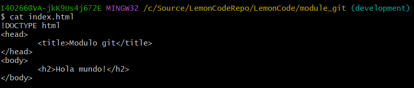
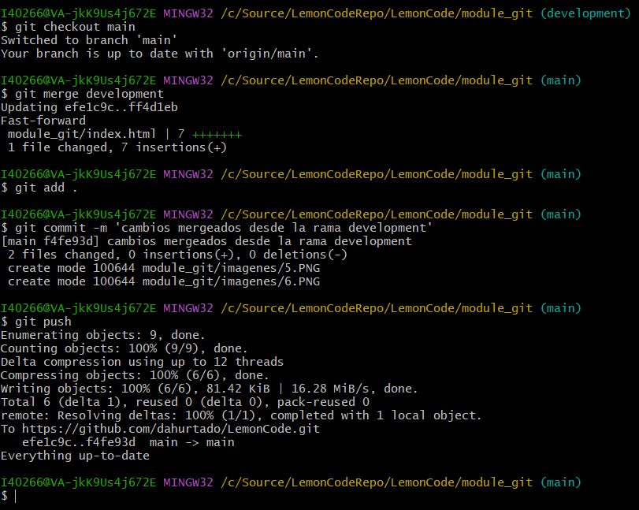

# Laboratorio Git
## 1. Repositorio local

He creado el repositorio en la carpeta C:/Source/LemonCodeRepo .
En esta carpeta he iniciado git con el comando *git init*

## 2. Repositorio en la nube

A continuacion hemos clonado el repositorio de mi GitHub, para demostrarlo aqui se puede ver que se ha establecido la conexion.
Aun asi, para el siguiente paso necesitamos que exista la conexion.

## 3. Commit y push

 - Se ha creado el archivo *index.html*
 - Hemos a;adido el archivo *index* con el comando *git add*
 - Se inserto un mensaje descriptivo en para el *commit*
 - Se han subido los cambios haciendo un *push*

A continuacion esta la lista de comandos que se ha usado para esta parte

Y como se puede comprobar, los cambios se han subido a GitHub

## 4. Ramas

 - Con el comando *git branch [nombre de rama]* he creado la rama 'development'
 - Se ha cambiado de rama con *checkout*
 - Y he escrito en el archivo *index.html*
   - Contenido del archivo

 - Se escribio un comentario descriptivo de los cambios realizados
 - Y se sincronizaron los cambios a GitHub

Imagen con el proceso y comandos para realizar este apartdao

## 5. Merge
